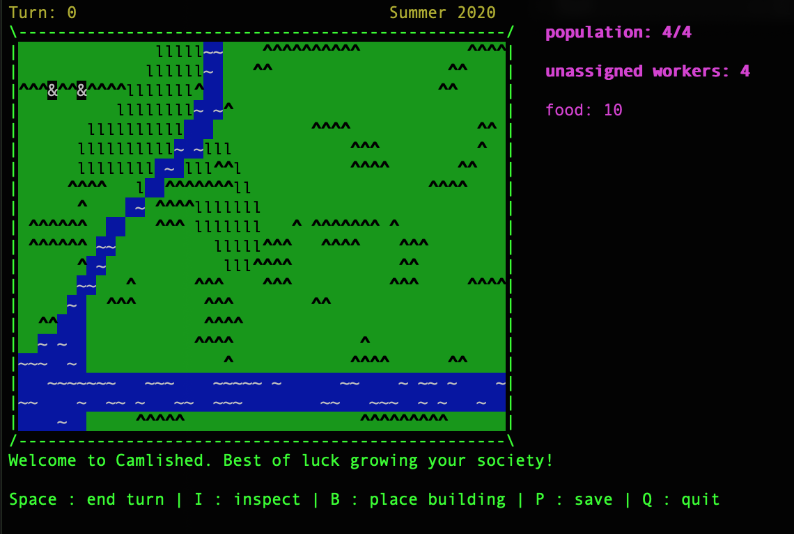
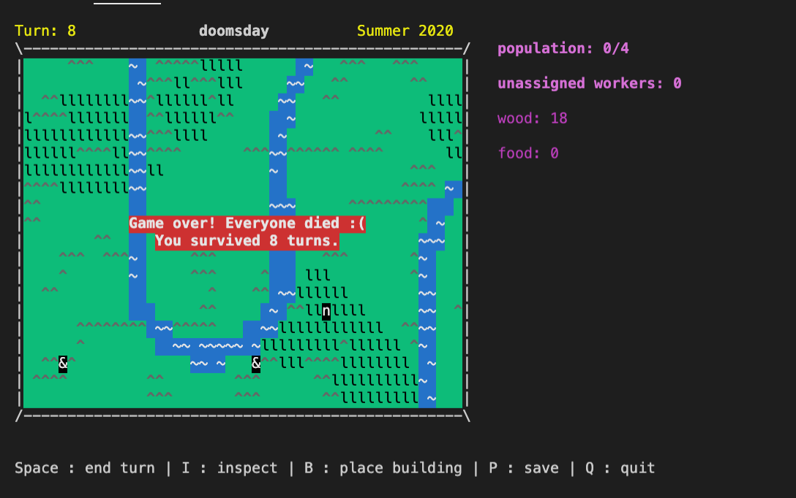

# Welcome to Camlished!




In a world where poorly cobbled together pieces of legacy code have led to a collapse in global infrastructure, you and a few other brave souls have decided to become free from the invasion of JavaScript dependencies. You heroes have decided to venture into the depths of Canada and form a society there to recover your strength so that one day, you can fight back with the power of functional programming.

However, your recovery will not come for free. You’ll start off with a very limited amount of resources which you’ll need in order to build your society: you can’t survive the cold winters of Manitoba without proper lodgings. You start off with another person living in a lodge. The two of you need to work together to gather the materials necessary to build more lodges, so that your society can grow. You’ll need to manage your resources effectively so that you’ll be able to build your infrastructure, including scavenging for and converting materials into more advanced versions. 

Make your choices wisely! The fate of the world depends on it.


# Installation:
```
$ opam install dune  
$ make  
$ make exec  
```

Controls:
* w -> Up
* s -> Down
* a -> Left
* d -> Right
* ; -> Select
* space -> Step
* c -> Cancel
* b -> Construct building
* q -> Quit
